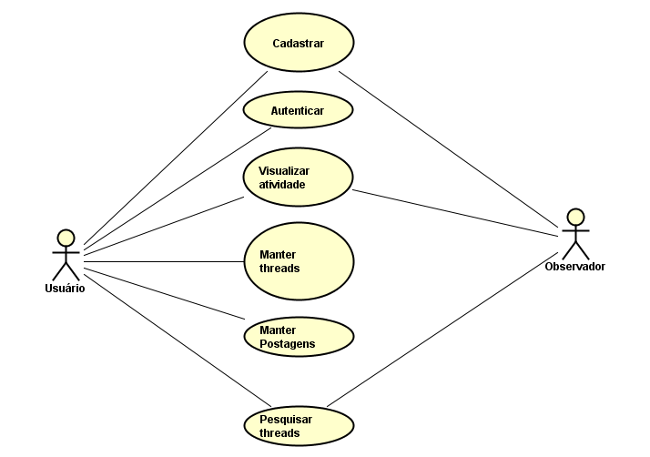
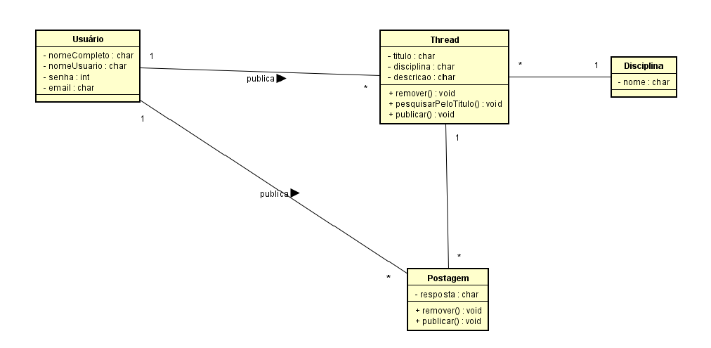
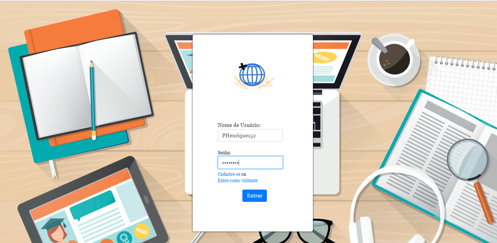
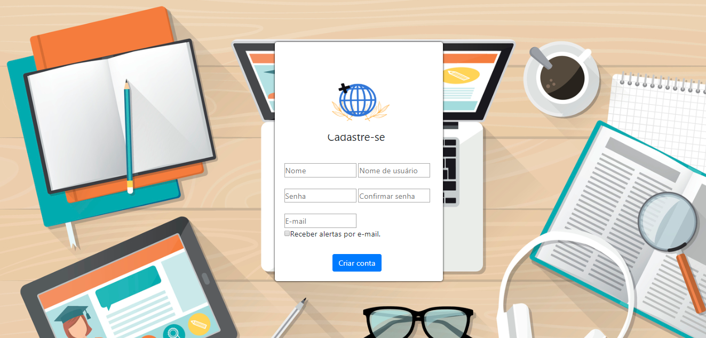
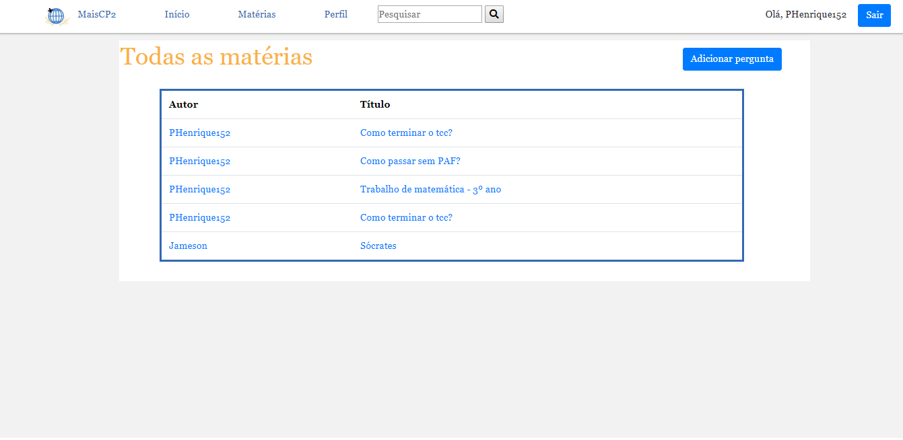
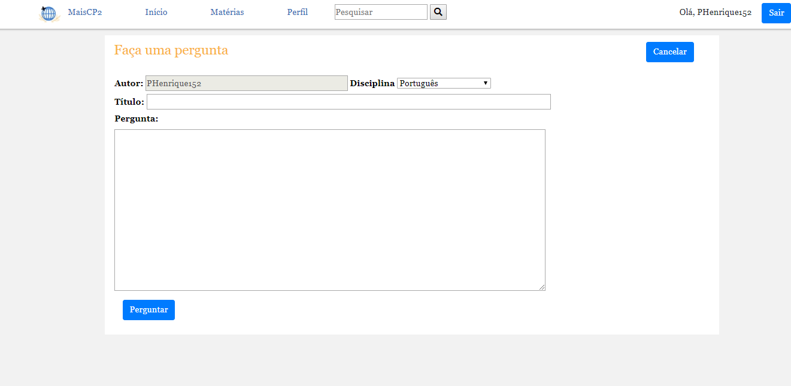
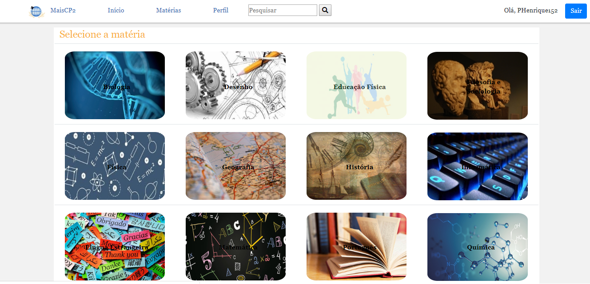
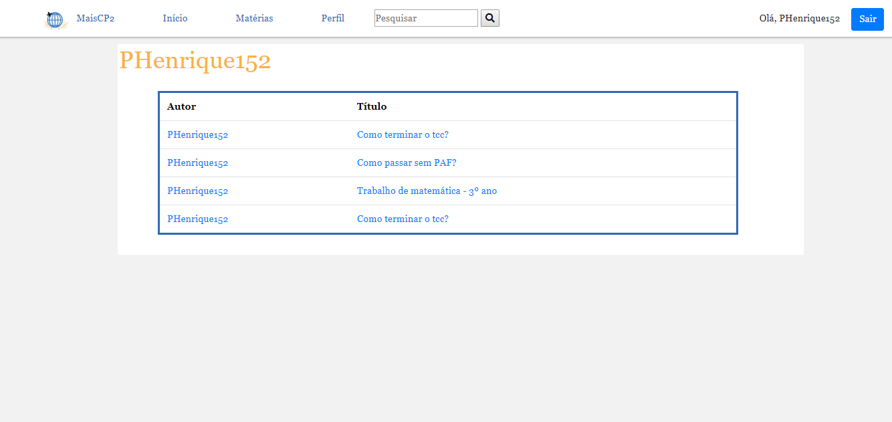

# MaisCP2

## Projeto Final do Curso Técnico em Informática do Colégio Pedro II – Campus Duque de Caxias – 2018

## Integrantes:

- Daniel Moreira dos Passos

- Géssica da Silva César

- Pedro Henrique da Silva Nascimento

- Rosa Silveira Pereira

## Sumário

- [Proposta](#proposta)
- [Casos de uso](#casos-de-uso)
- [Modelagem](#modelagem)
- [Manual](#manual)

### Proposta

#### Descrição

O projeto que foi escolhido será um fórum educacional. Ou seja, um fórum onde serão discutidos assuntos acadêmicos de alunos e professores, majoritariamente do Colégio Pedro II: podendo ser provas, dúvidas, ajuda em matérias específicas e etc., porém sempre presando antes de mais nada o debate. O fórum será dividido em matérias, tendo em vista que será melhor para a organização do site. Os usuários podem criar threads de discussão e responder a essas threads, enquanto um visitante só pode visualizá-las. O projeto busca fornecer uma plataforma de discussão e debate para alunos e professores, principalmente do Colégio Pedro II, onde as mais diversas questões acadêmicas possam ser debatidas. O intuito da plataforma é prezar pela discussão e o debate saudável entre os integrantes da comunidade, sem hierarquizá-los, para ampliar as discussões acadêmicas para fora da sala de aula.

#### Stakeholder

- Gabriel Uriel - Professor de Biologia do Colégio Pedro II - Campus Duque de Caxias

#### Link para os requisitos

[Requisitos funcionais e não funcionais](https://github.com/cp2-dc-info-projeto-final-2018/MaisCP2/blob/master/Documenta%C3%A7%C3%A3o/requisitos.md)

### Casos de uso

[Descrição dos casos de uso](https://github.com/cp2-dc-info-projeto-final-2018/MaisCP2/blob/master/Documenta%C3%A7%C3%A3o/casosDeUso.md)

### Modelagem

Diagrama de classes

Modelo do Banco de Dados

[script banco de dados](https://github.com/cp2-dc-info-projeto-final-2018/MaisCP2/blob/master/Documenta%C3%A7%C3%A3o/bd.sql)

### Manual

Caso o usuário já tenha uma conta ele poderá fazer o login na página principal do site.

Caso o usuário não tenha uma conta ele poderá se cadastrar na página de cadastro, que pode ser acessada através da página principal.

Após cadastrar-se e efetuar o login, o usuário será direcionado para a página principal, onde ele pode acessar as threads que já foram criadas e os perfis que já fizeram uma thread.

O usuário pode adicionar threads utilizando o botão "Adicionar Thread". Ao preencher os dados no formulário e enviá-lo, a thread terá sido enviada com sucesso para a página principal do site e para a página de sua respectiva matéria.

Ao clicar em "Matérias" o usuário será direcionado para a página de exibição das diferentes disciplinas. Ao clicar em qualquer uma das opções, o usuário será direcionado para uma página onde só estão threads da matéria selecionada.

Para acessar seu Perfil, basta clicar no link "Perfil"

E para efetuar uma pesquisa por uma thread específica, basta utilizar o campo "Pesquisar" que está disponível em todo o site.

Caso o usuário deseje sair do site, basta clicar no botão "Sair" a qualquer momento.
